# 📝 Blog Platform – Next.js App

A full-stack **Next.js-based blogging platform** with authentication, blog management, categories, and interactive features like likes, comments, and views.  
Designed for a smooth **content creation** and **reading experience**.

---

## 🌐 Live Demo
[**dj-blogs.dilip.live**](https://dj-blogs.dilip.live)

---

## 🚀 Features

- **Authentication**
  - User Signup, Login, Logout
  - Email verification
  - Secure session handling (NextAuth.js)

- **Blog Management**
  - Create, edit, delete blogs
  - Create blogs using **MDX Editor**
  - Categorize blogs
  - Track views and likes

- **User Dashboard**
  - View blog statistics
  - Manage personal blogs
  - Edit profile

- **Engagement**
  - Like and unlike posts
  - Comment system with replies
  - Reaction support for comments

- **Responsive UI**
  - Tailwind CSS for styling
  - Optimized for desktop & mobile

---

## 🛠 Implementation Details

### **Tech Stack**
- **Frontend:** Next.js (App Router), React, Tailwind CSS
- **Backend:** Next.js Route Handlers (API routes)
- **Authentication:** NextAuth.js
- **Database:** MongoDB
- **State Management:** React hooks
- **Styling:** Tailwind CSS

## 🖼 Demo Images

Below are some screenshots of the application in action.

### 🏠 Homepage
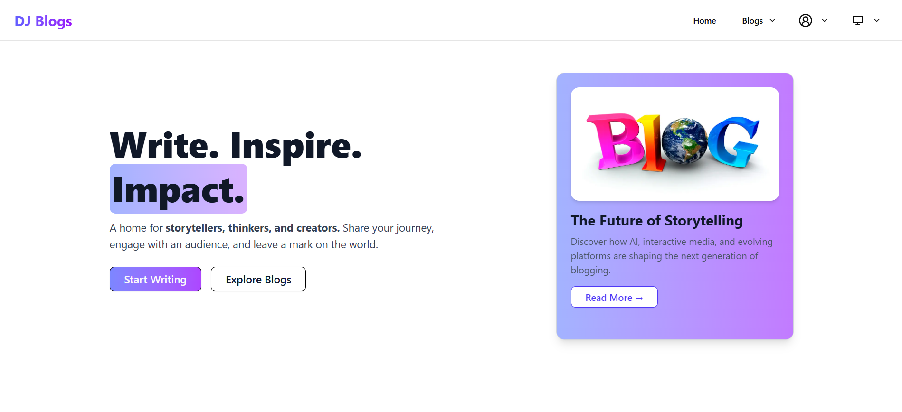

### 📄 Blog
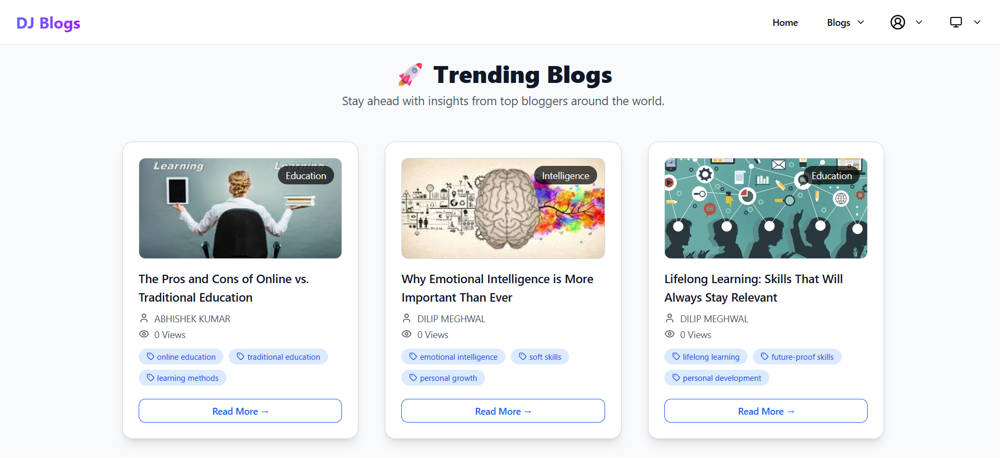
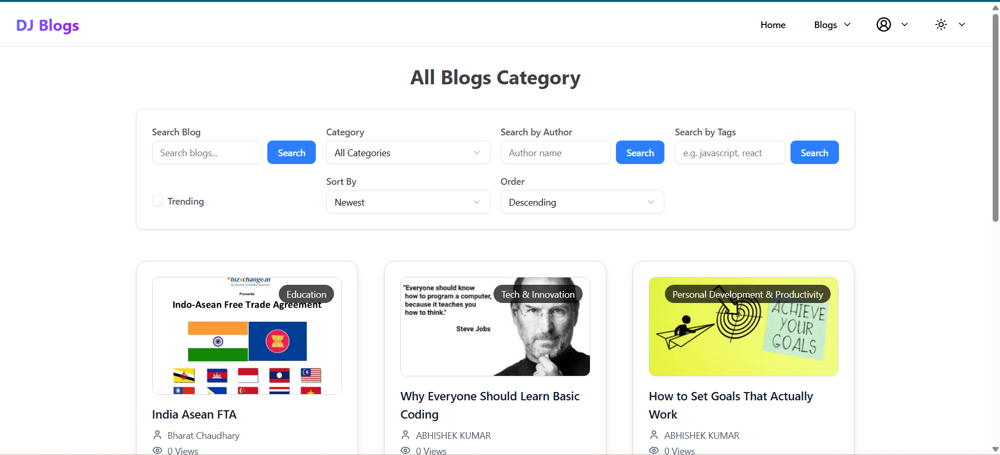
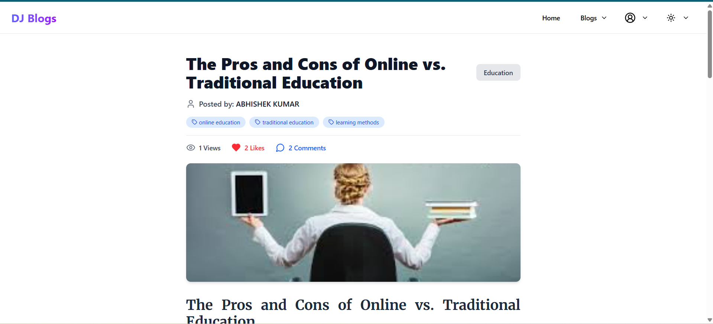
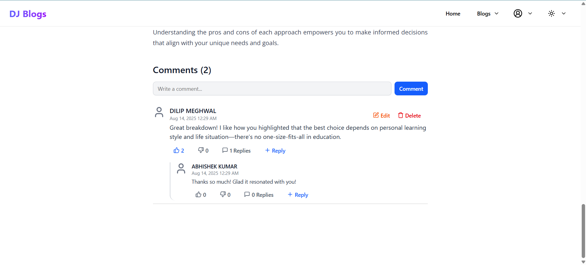
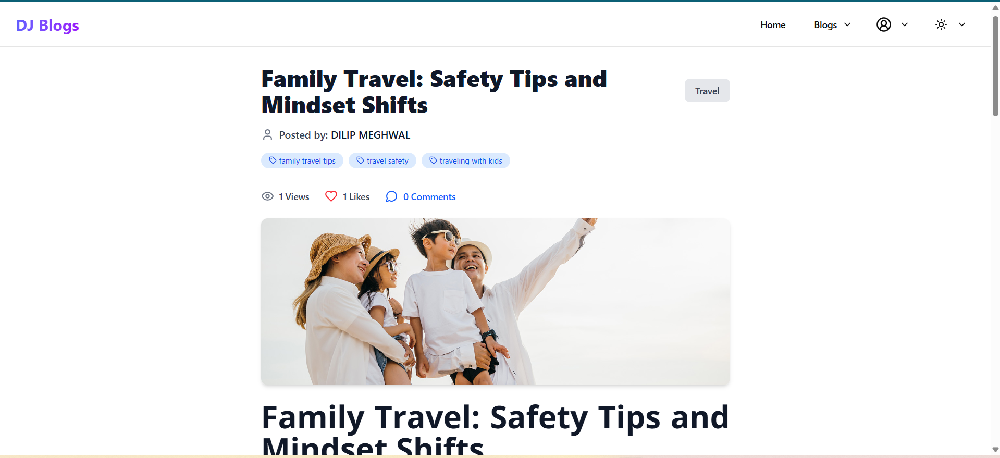
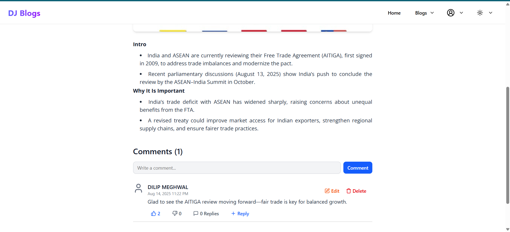

### 📊 User Dashboard
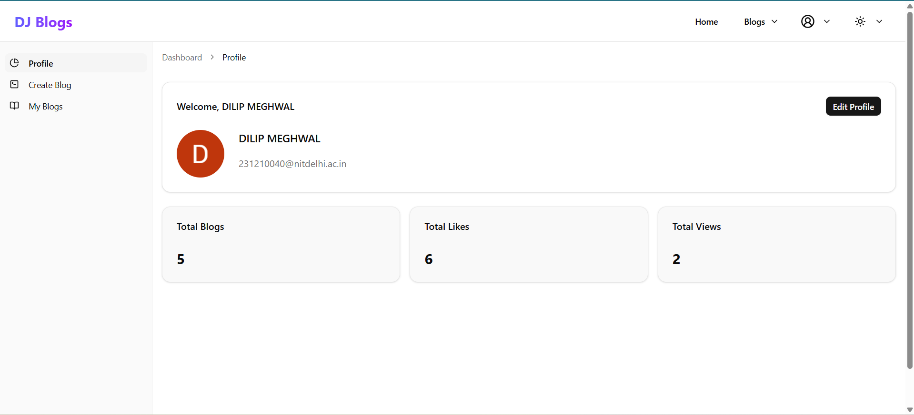
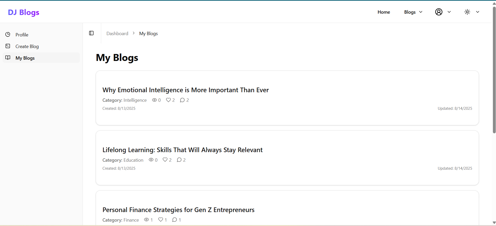

### ✍️ Blog Editor (MDX)
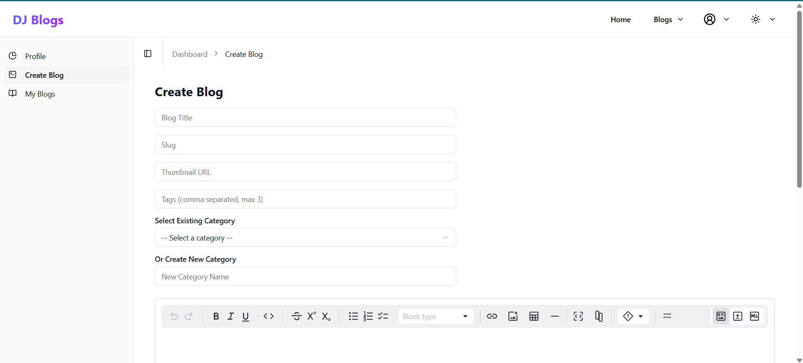
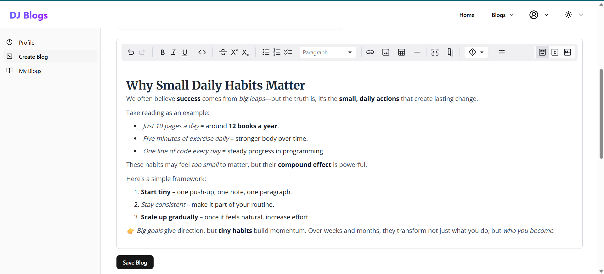

